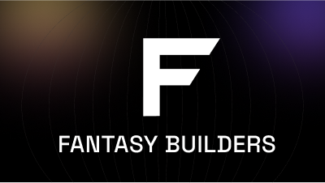

## Hi there 👋

<!--

**Here are some ideas to get you started:**

🙋‍♀️ A short introduction - what is your organization all about?
🌈 Contribution guidelines - how can the community get involved?
👩‍💻 Useful resources - where can the community find your docs? Is there anything else the community should know?
🍿 Fun facts - what does your team eat for breakfast?
🧙 Remember, you can do mighty things with the power of [Markdown](https://docs.github.com/github/writing-on-github/getting-started-with-writing-and-formatting-on-github/basic-writing-and-formatting-syntax)
-->

  

  

  

  
  
  

  

  

  

Fantasy Builders is a dynamic team of blockchain developers and crypto enthusiasts dedicated to creating innovative solutions in the Web3 space. We specialize in:

  <table>
    <tr>
      <td align="center" width="96">
        
      </td>
      <td align="center" width="96">
        
      </td>
      <td align="center" width="96">
        
      </td>
      <td align="center" width="96">
        
      </td>
      <td align="center" width="96">
        
      </td>
      <td align="center" width="96">
        
      </td>
    </tr>
    <tr>
      <td align="center">Smart Contracts</td>
      <td align="center">DeFi</td>
      <td align="center">Gaming</td>
      <td align="center">Security</td>
      <td align="center">Web3</td>
      <td align="center">NFT</td>
    </tr>
  </table>

  

  
  
  
  
  
  
  
  

  

  
  

  

  

  <table>
    <tr>
      <td><b>Project</b></td>
      <td><b>Description</b></td>
      <td><b>Status</b></td>
    </tr>
    <tr>
      <td><a href="https://github.com/YOUR_GITHUB/project1">DeFi Protocol</a></td>
      <td>Advanced DeFi protocol with yield farming</td>
      <td>🚀 Active</td>
    </tr>
    <tr>
      <td><a href="https://github.com/YOUR_GITHUB/project2">NFT Marketplace</a></td>
      <td>Cross-chain NFT trading platform</td>
      <td>🔄 In Development</td>
    </tr>
    <tr>
      <td><a href="https://github.com/YOUR_GITHUB/project3">Blockchain Game</a></td>
      <td>Play-to-earn strategy game</td>
      <td>📝 Planning</td>
    </tr>
  </table>

  

  

We're always looking for talented developers to join our team! If you're passionate about blockchain technology and want to be part of something big, we'd love to hear from you.

  
  
  

  

  

At Fantasy Builders, we believe in the power of blockchain technology to transform the world. Our mission is to create innovative solutions that make a difference in the crypto space and beyond.

  

  

  

  
  

  

  

